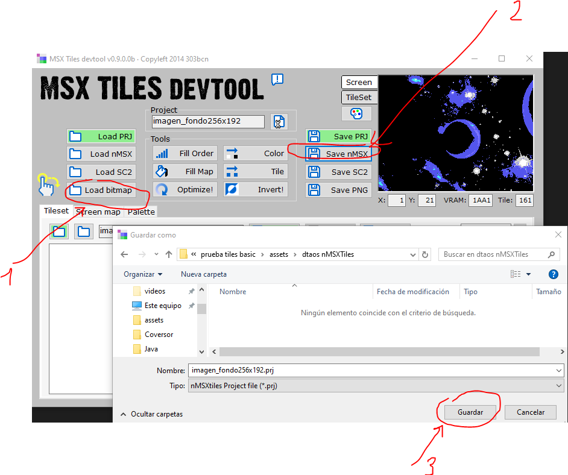
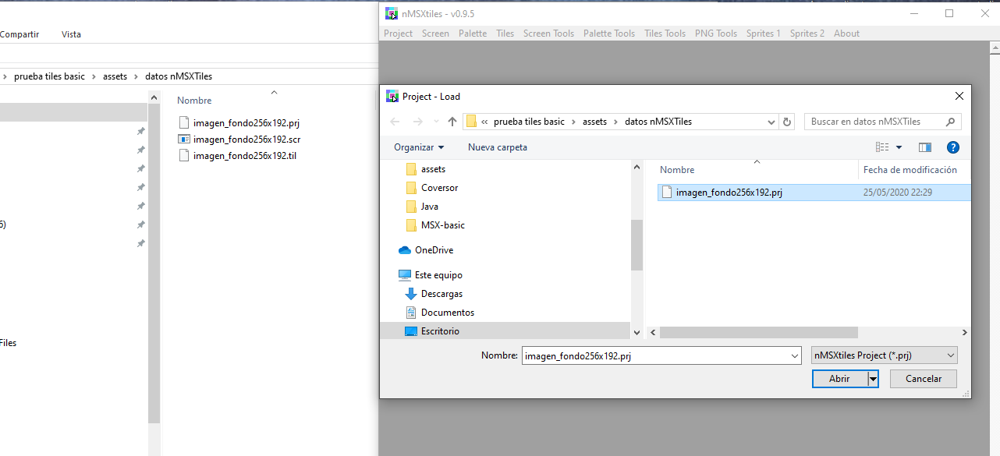
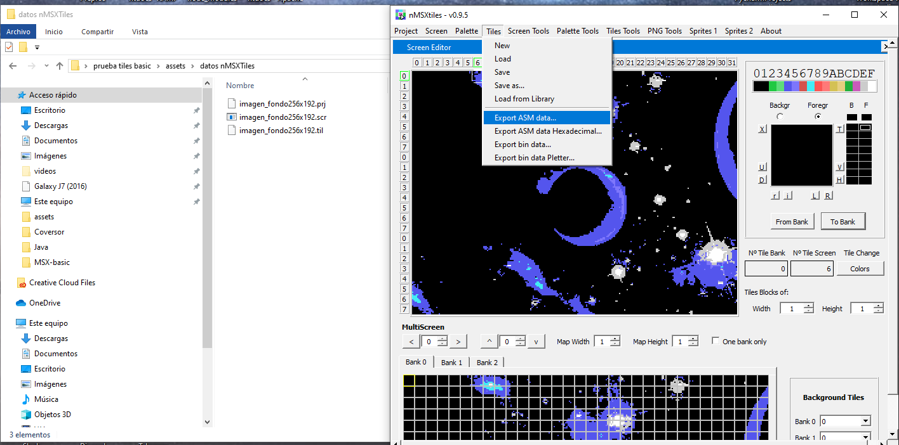
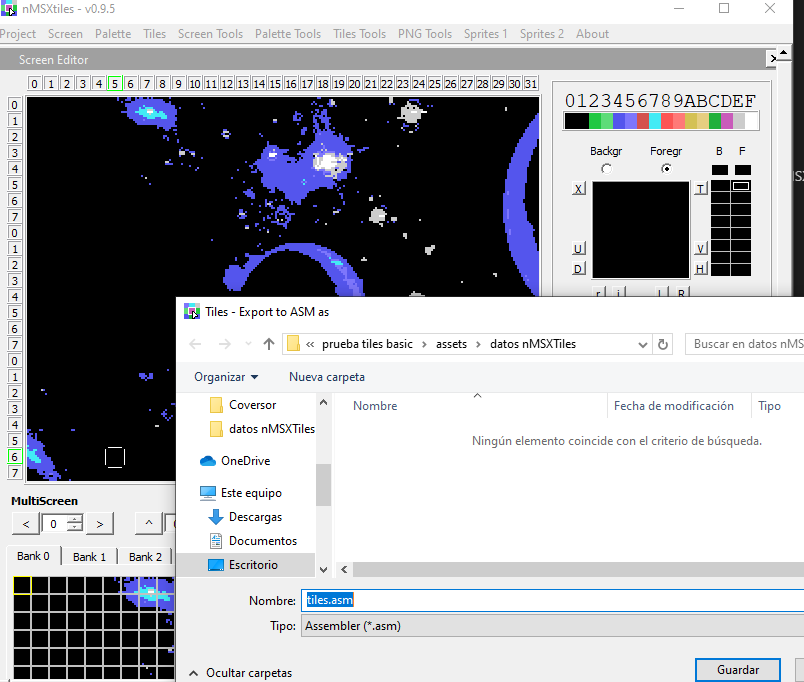
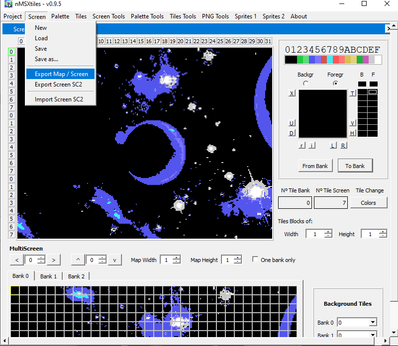
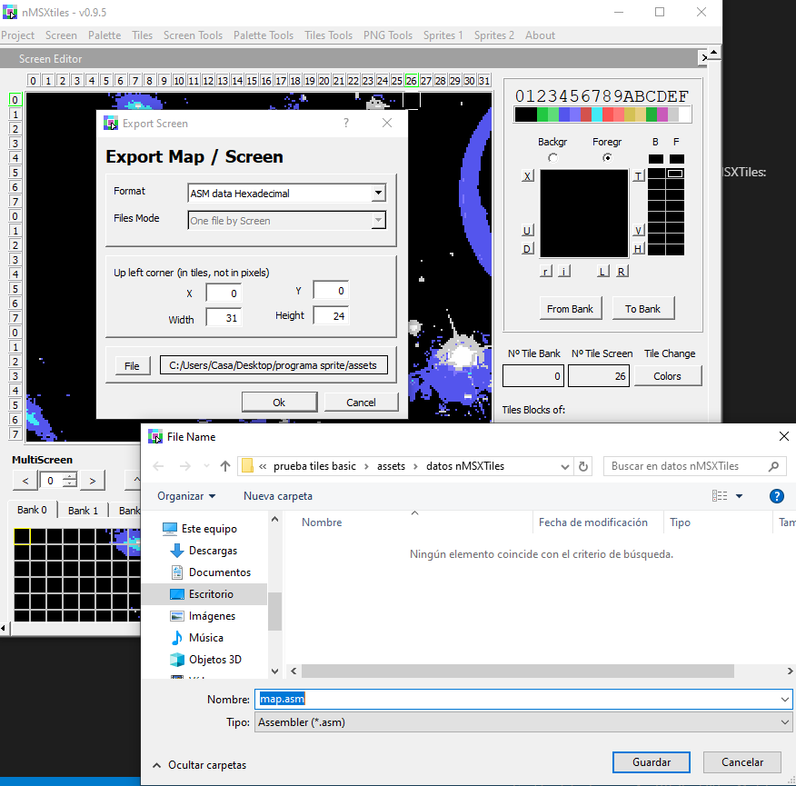
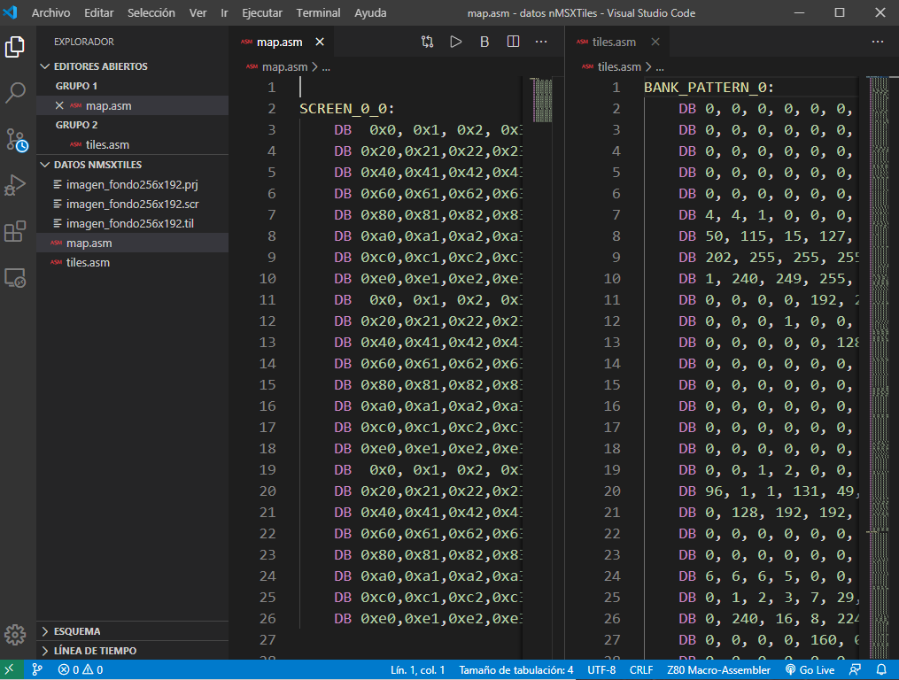

# ¿Que es asm to bas?

Es un complemento para poder crear cósidog MSX basic para convertir las línes de código de los archivos generados por NMSXTiles.
Tu puedes abrir una imagen 256x192px con MSXTilesdevTool y convertirla a un proyecto nMSXTile:

Una vez obtenidos los archivos nMSXTiles, podemos abrir el proyecto con el programa nMSXTiles:

y podemos exportar los tiles y el map (o screen) como asm data:

Este sería el aspecto de los archivos map y tiles:

Como podemos ver no es código basic, para eso tenemos que utilizar este programa: 

